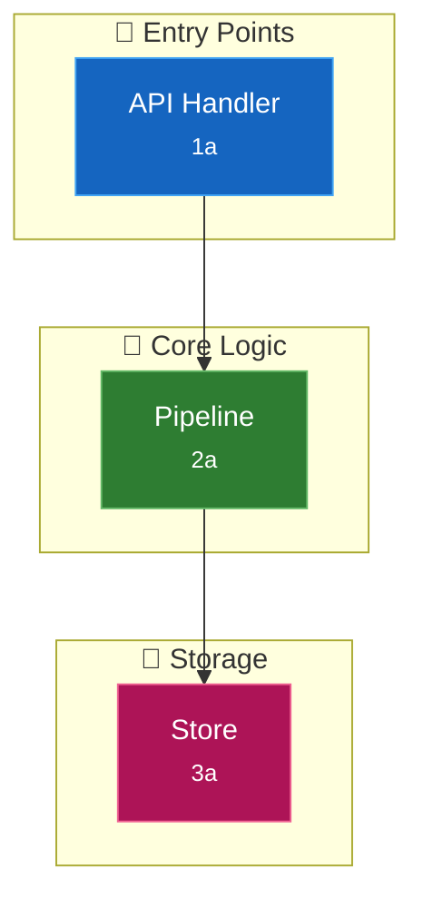
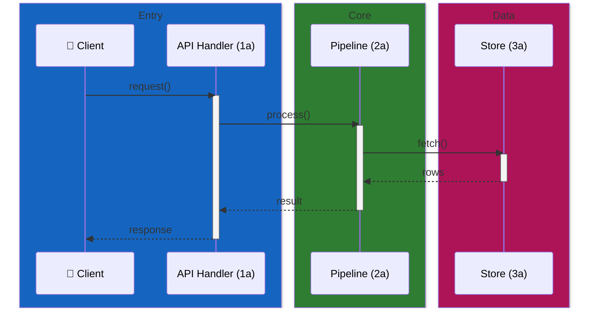
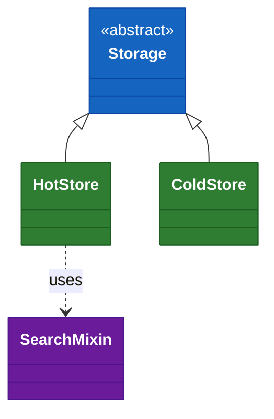

# Code Map Generator (Graph-Powered)

Generate `docs/CODEMAP-GRAPH.md` with bidirectional links between Mermaid diagrams and source code, using the `code-review-graph` knowledge graph as the source of truth for symbols, file:line locations, and relationships. Falls back to Grep/Read when the graph cannot answer.

This skill is the graph-aware variant of [`codemap`](../codemap/SKILL.md). The output format, ID scheme, and colour palette are identical between the two skills — what changes is **how** you gather the evidence.

## Why use the graph

| Task | Without graph | With graph |
|------|--------------|------------|
| Enumerate classes/functions in a module | Read every file, hope nothing is missed | One `query_graph_tool` call, returns symbols with file:line |
| "What calls this function?" | Recursive grep, often misses dynamic dispatch | `query_graph_tool(pattern="callers_of", target=...)` |
| "What does changing this break?" | Manual reasoning across files | `get_impact_radius_tool` |
| "Find the thing the user named" | Glob + grep guesswork | `semantic_search_nodes_tool` |
| Token cost on large repos | 2–5× higher (file reads to enumerate) | Bounded queries, file:line returned directly |

**Bottom line**: every diagram node should be backed by a graph node when possible. Curation, layout, and grouping remain LLM judgment calls.

## When to use this skill vs plain `codemap`

Use `codemap-gr` when:
- The repo has a `.code-review-graph/` directory (graph already exists), OR
- The `code-review-graph` MCP tools are available in the session
- Languages in the repo are graph-supported (Python, TS/JS, Vue, Go, Rust, Java, Scala, C#, Ruby, Kotlin, Swift, PHP, Solidity, C/C++)

Use plain `codemap` when:
- No graph available and you don't want to build one
- Repo is small enough that file reads are cheap
- Primary languages are unsupported (Perl, R, shell, SQL only)

## Required Workflow

Follow these steps in order. Do not skip steps 0–2; they prevent stale or sloppy diagrams.

### Step 0: Check graph availability and freshness

Call `list_graph_stats_tool` first. Three outcomes:

1. **No graph exists** (`last_updated` is null): Tell the user and offer to build it. Do not silently proceed without one — that defeats the whole point of this skill. If the user declines, fall back to the plain `codemap` skill.
2. **Graph is fresh** (updated within ~24h or no edits since `last_updated`): Proceed.
3. **Graph is stale** (older than 24h, or git shows commits/edits since `last_updated`): Run `build_or_update_graph_tool()` (incremental). For major refactors or branch switches, use `build_or_update_graph_tool(full_rebuild=True)`.

**Always record the graph timestamp in CODEMAP-GRAPH.md** (see Output Header below) so future readers can judge freshness.

### Step 1: Identify architectural layers

Same as plain codemap: group by responsibility (entry points, application, core logic, data, background). Numbered categories `[1]`, `[2]`, … with letter-suffixed components `[1a]`, `[1b]`.

For initial exploration, prefer `semantic_search_nodes_tool` over globbing — e.g., `semantic_search_nodes_tool(query="HTTP request handler entry point")` to find the surface for category `[1]`.

### Step 2: Populate components from the graph

For each candidate component:

1. Use `semantic_search_nodes_tool` or `query_graph_tool` to locate the symbol.
2. Record the **graph-provided file:line** — never guess line numbers.
3. Use `query_graph_tool(pattern="callers_of", target=<symbol>)` and `callees_of` to draw arrows in the diagram. Arrows must reflect graph edges, not LLM inference.
4. For "central" components (high blast radius), call `get_impact_radius_tool` and consider whether the diagram needs a focused subdiagram for that component's neighborhood.

### Step 3: Curate (this is still your job)

The graph for a non-trivial repo has thousands of nodes. A diagram should not. Apply judgment:

- **Max 10–15 nodes per diagram.** If you have more, split into focused subdiagrams.
- **Public API > private helpers.** Skip nodes that are pure implementation detail.
- **Stable structure > one-off scripts.** Skip throwaway or generated code unless it's load-bearing.
- **Cross-layer edges only.** Within a single class, drawing every method-to-method call is noise — use a class diagram for that.

### Step 4: Identify and document gaps

The graph **will** miss things. Track them explicitly:

| Gap source | Fallback |
|------------|----------|
| Subprocess invocations (shelling out to binaries) | `Grep` for the binary or script name |
| Cross-language calls (Python → R, Java → Perl) | `Grep` and label edges as "shells out to" |
| Languages outside graph support | `Grep` + `Read`, mark nodes with a footnote |
| Dynamic dispatch / reflection / DI containers | `Grep` for registration sites |
| Empty/sparse graph areas (e.g., Java imports not extracted) | Note in output, fall back to imports analysis |

**In CODEMAP-GRAPH.md, mark each diagram element with its source**: ✓ graph-verified, ⚠️ grep-inferred, or ❓ unverified. Readers must be able to tell which parts to trust.

### Step 5: Build the document

Structure the output with these elements:

- **System overview flowchart** with `<br/><small>ID</small>` node labels (not bracket suffixes)
- **Per-category `### [N] Name` sections**, each with a reference table: ID | Component | Description | File:Line
- **Focused subdiagrams** for complex subsystems (one per cluster, not one per node)
- **Sequence / class / ER diagrams** where they add value — not by default
- **Quick navigation table** at the top or bottom

Source annotations live in the source, not in the doc — step 6 adds them. Do not skip step 6; the skill is called "bidirectional" for a reason, and without the source side you've only built half of it.

Use `<br/><small>ID</small>` in node labels, not `[1a]` suffixes:

```
A["Pipeline<br/><small>1a</small>"]       # prefer this
A["Pipeline [1a]"]                         # avoid
```

#### High-Contrast Mermaid Colour System

**One colour per architectural layer, applied consistently across every diagram.** This is non-negotiable — readers use colour to track layers across multiple diagrams. Inconsistency breaks that mental model.

**High contrast means saturated fills + white text, not pastels.** Every layer below hits ≥7:1 contrast ratio (WCAG AAA) between fill and text. Strokes are a darker shade of the fill for shape definition without chromatic noise.

| Layer | Fill | Stroke | Text | Contrast | Emoji |
|-------|------|--------|------|----------|-------|
| Entry points / hot path | `#1565c0` | `#0d47a1` | `#ffffff` | 8.6:1 | 🚀 |
| Application / server | `#d84315` | `#bf360c` | `#ffffff` | 5.9:1 † | ⚙️ |
| Core logic / pipeline | `#2e7d32` | `#1b5e20` | `#ffffff` | 6.4:1 | 🧠 |
| Data / storage | `#ad1457` | `#880e4f` | `#ffffff` | 8.2:1 | 💾 |
| Infrastructure / async | `#6a1b9a` | `#4a148c` | `#ffffff` | 10.4:1 | 🔧 |
| Graph-inferred fallback (⚠️) | `#ef6c00` | `#e65100` | `#000000` | 6.8:1 | ⚠️ |
| Unverified (❓) | `#424242` | `#212121` | `#ffffff` | 11.6:1 | ❓ |

† Application/server hits AA (≥4.5:1) but not AAA. If you need AAA across the board, swap the fill to `#bf360c` and the stroke to `#8c2900`.

**Contrast discipline** — the rules this palette enforces:

- Fills are material-design 800-weight (L≈30–35) — dark enough for white text to hit AAA
- Text is pure white (`#ffffff`) or pure black (`#000000`) — never mid-tone greys that drift toward AA failure
- Strokes are 900-weight of the same hue for shape definition — one step darker than the fill, no colour clash
- **Never use pastel fills** (`#e8f4fd` etc.) — they force dark text, which looks washed out in dark-mode GitHub and fails contrast on amber/yellow hues entirely
- Test every diagram in both light and dark GitHub themes before committing. If text becomes hard to read in either, the fill is wrong

**Style nodes, not subgraphs.** Mermaid's flowchart renderer reliably applies `style NodeId fill:...` but treats styled subgraphs inconsistently across themes — a saturated subgraph fill can be overridden by the theme or lightened in certain viewers, producing a pale backdrop with the default (also pale) node fills sitting unreadably on top.

The pattern that works everywhere (and matches `docs/CODEMAP.md`): **leave subgraphs at their default pale-yellow fill, style every node with its layer's saturated colour and white text.** The subgraph's title + the node colour together communicate the layer — you don't need both fills saturated.



Node stroke colours (one step lighter than the fill, not darker — this gives the node a visible edge against the same-hue subgraph):

| Layer | Node fill | Node stroke |
|-------|-----------|-------------|
| Entry points | `#1565c0` | `#42a5f5` |
| Application | `#d84315` | `#ff7043` |
| Core logic | `#2e7d32` | `#66bb6a` |
| Data / storage | `#ad1457` | `#f06292` |
| Infrastructure | `#6a1b9a` | `#ab47bc` |

For individual nodes that need the ⚠️/❓ fallback colour (graph didn't verify them), override at the node level after the layer styling. Note ⚠️ uses black text on amber — white on amber fails contrast:

```mermaid
    D["Perl Script<br/><small>5a ⚠️</small>"]
    style D fill:#ef6c00,stroke:#ffa726,color:#000000
```

**Validation**: render with `mmdc` or `@probelabs/maid` and check that every node label is legible at normal zoom. If any node shows dark-on-dark or dark-on-saturated text, you forgot the per-node `style` line.

#### Sequence Diagrams

Group participants into coloured `box` regions matching the flowchart palette. Use `activate`/`deactivate` and `-->>` return arrows so the reader sees call lifetimes, not just one-way arrows.

**Use the exact same saturated 800-weight fills as the flowchart subgraphs — NEVER pastels.** Mermaid renders participant labels as light/white text on sequence `box` fills, so a pale box (e.g. `rgb(187, 222, 251)`) leaves white-on-pale-blue text that is unreadable. The saturated material-800 RGBs below hit AAA contrast and match the flowchart colour system exactly, so readers can map boxes ↔ subgraphs at a glance.

| Layer | Box RGB | Hex equivalent |
|-------|---------|----------------|
| 🚀 Entry points | `rgb(21, 101, 192)` | `#1565c0` |
| ⚙️ Application / server | `rgb(216, 67, 21)` | `#d84315` |
| 🧠 Core logic | `rgb(46, 125, 50)` | `#2e7d32` |
| 💾 Data / storage | `rgb(173, 20, 87)` | `#ad1457` |
| 🔧 Infrastructure | `rgb(106, 27, 154)` | `#6a1b9a` |



Rules:
- Box fills MUST match the flowchart layer RGBs above — no pastels, no one-off tints.
- Keep participant aliases short. Use parentheses `(1a)` not brackets `[1a]` — brackets break Mermaid sequence syntax.
- If a box ends up with only one participant, consider whether it deserves its own region or should be merged with a neighbour.
- Verify the rendered output in both GitHub light and dark themes before committing. If participant text on any box is hard to read, the fill is wrong — do not "fix" it by switching to pastels.

#### Class Diagrams

Colour abstract base classes differently from concrete implementations. Group related concrete classes under one colour:



#### General Rules

- One emoji per subgraph title for quick scanning — never more
- Don't style edges (keep default arrow colours); the node fills already carry the layer signal
- Render every diagram on GitHub (or via `@probelabs/maid`) before committing — Mermaid is picky about whitespace in `style` lines
- If a diagram needs more than 5 layers, you're probably drawing too much on one diagram — split it

### Step 6: Annotate source files (the reverse link — mandatory)

A "bidirectional code map" is only bidirectional if a developer reading the source can find the doc. The file:line links in step 5 give doc→source navigation for free via the graph. This step adds source→doc navigation.

**For every row in every reference table, add a single-line comment at the referenced file:line** using the language's comment syntax. The ID format is `[ID:SymbolName]` — the bare `[ID]` variant has been observed to drift from source within days and cannot be programmatically re-located when code shifts, because reference tables often have multiple rows sharing an ID (e.g. `[3a]` covering both `calculate_ld` and `find_plink`).

| Language | Annotation |
|----------|------------|
| Python | `# [1a:run_pipeline] Pipeline orchestrator — runs selected stages` |
| TS/JS | `// [1a:runPipeline] Pipeline orchestrator — runs selected stages` |
| Go / Rust / Java / C# | `// [1a:RunPipeline] Pipeline orchestrator — runs selected stages` |
| Ruby / shell | `# [1a:run_pipeline] Pipeline orchestrator — runs selected stages` |
| SQL | `-- [1a:run_pipeline] Pipeline orchestrator — runs selected stages` |

Placement rules — each exists because the looser variant has been observed to rot in real projects:

- **Directly above** the `def`/`class`/`function`/`const` being referenced, at the same indentation — never inside the body. The sync script depends on `anchor_line + 1 == target_line`; a blank line or unrelated comment between them breaks drift detection.
- **For decorated functions, the anchor goes above the decorator**, not between the decorator and the `def`.
- **Never above a module docstring.** An anchor on line 1 of a Python file shadows the docstring from Sphinx `automodule`, `help()`, and IDE hover (the first comment-or-expression becomes `__doc__`). Put the anchor below the closing `"""` of the module docstring and reference IDs inside the docstring prose instead.
- **One line only.** Keep the description short (≤70 chars after the ID+symbol). If you need more, link to the doc section instead of expanding the comment.
- **Exact ID match** to the reference table (`[1a:run_pipeline]`, not `[1A:…]` or `(1a:…)`).
- **Do not remove existing annotations** from earlier codemap runs — update them in place if the ID, symbol, or description changed. If an annotation's ID/symbol no longer appears in any reference table, remove it (the component was dropped).
- **Do not annotate** private helpers, test files, or nodes that didn't make it into the diagram. Annotations are a costly signal; one per public-facing component is the target.

Use Edit, not Write — these are surgical single-line additions to existing files. For files with many annotations (e.g. a module index), batch edits in parallel.

**Ship the anti-drift sync script alongside the doc.** See [`codemap/SKILL.md` → Anti-Drift Automation](../codemap/SKILL.md#anti-drift-automation) for the drop-in `scripts/sync-codemap.py` template and pre-commit snippet. The script regenerates `file:line` references from the `[ID:Symbol]` anchors and fails the commit on drift — without it, the doc starts lying within days of merge. This is not optional: a generated code map with no sync machinery is a ticking liability, and a real review of a skill-generated CODEMAP.md found every single anchor had drifted within 3 days.

**Skipping this step is the single most common failure mode of this skill.** The doc still renders, the links still work, and the broken half isn't visible from the doc — it's only visible when someone opens a source file and has no breadcrumb back. If you're tempted to stop at step 5, re-read this paragraph.

### Step 7: Validate

- **Run `python scripts/sync-codemap.py` in check mode** — zero exit confirms every doc row's `file:line` matches its `[ID:Symbol]` anchor. This replaces spot-checking; the script is exhaustive.
- Every diagram node has a row in a reference table.
- **Every reference table row has a matching `# [Nx:SymbolName] ...` annotation in source** — the sync script enforces this (missing anchors are a hard error). No grep spot-check needed if the script passes.
- **No orphan annotations** — every `# [Nx:SymbolName]` comment in source should correspond to a row in the current doc. Stale IDs confuse future readers more than missing ones. (The sync script only validates doc→code; catch orphans by grepping `# \[[0-9][a-z]:` and diffing against doc rows.)
- Mermaid renders cleanly (run `@probelabs/maid` or `mmdc` if available).

## Output Header

Add a provenance block at the top of CODEMAP-GRAPH.md so readers know what they're looking at:

```markdown
# Code Map

> Generated against code-review-graph snapshot from `<last_updated timestamp>`.
> Graph nodes: <N> · Files indexed: <M> · Languages: <list>
> Elements marked ⚠️ were inferred via grep (not graph-verified).
> Elements marked ❓ were not verified — review before relying on them.
```

Do **not** include any "generated by Claude" or agent-attribution comments — see CLAUDE.md "Strip Generator Tags from Committed Docs".

## Cross-Repo Diagrams

If the user asks for a code map spanning multiple repos and `cross_repo_search_tool` is available, use it for inter-repo edges. Otherwise note that cross-repo links are out of scope and link to each repo's own CODEMAP-GRAPH.md instead.

## Anti-Patterns

Things this skill exists to prevent — if you catch yourself doing any of these, stop:

- **Reading every file in `src/` to enumerate symbols.** That's what `query_graph_tool` is for.
- **Writing line numbers from memory or guessing.** Always pull from a graph response or a fresh Read.
- **Drawing arrows based on "this probably calls that".** Arrows = graph edges or grep evidence.
- **Silently falling back to grep** without marking the node ⚠️ in the output.
- **Generating CODEMAP-GRAPH.md against a stale graph** without warning the user or rebuilding.
- **Including all 3000+ graph nodes** because "the graph said so". Curation is still your job.
- **Stopping at step 5.** The skill is "bidirectional"; one direction is a failure. If you haven't edited source files with `# [Nx:SymbolName]` annotations AND installed the sync script, you aren't done.

## Tips

- For "show me how X flows through the system" requests, start with `semantic_search_nodes_tool` to find X, then chain `callers_of` (upstream) and `callees_of` (downstream) to walk the flow — much cheaper than reading files.
- `get_impact_radius_tool` is a quick sanity check on whether a node deserves to be on the overview diagram. Tiny radius → probably belongs in a subdiagram or omitted.
- Re-run `list_graph_stats_tool` at the end and add any change to the header — useful if the graph rebuilt mid-session.
- The ✓/⚠️/❓ markers belong *in* the diagram (next to the ID in the node label) AND in the reference table's Component column — readers need the signal in both places.
- Max 10–15 nodes per diagram. If you hit the limit because you have too many graph-verified nodes, that means you should split the diagram, not drop the standard.
