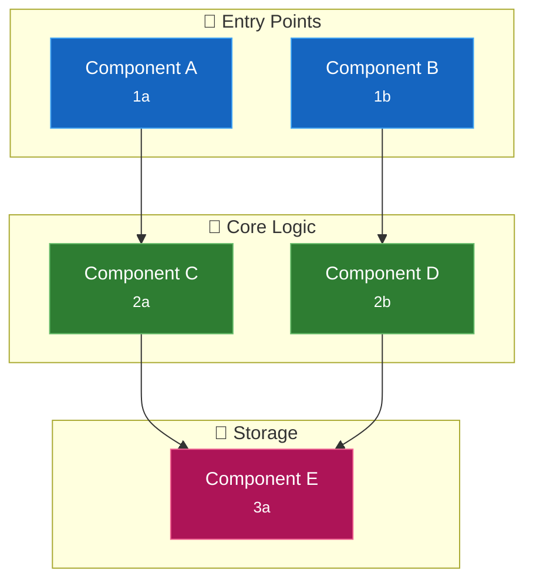
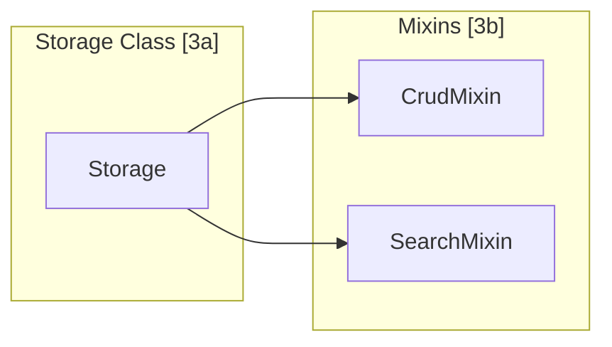
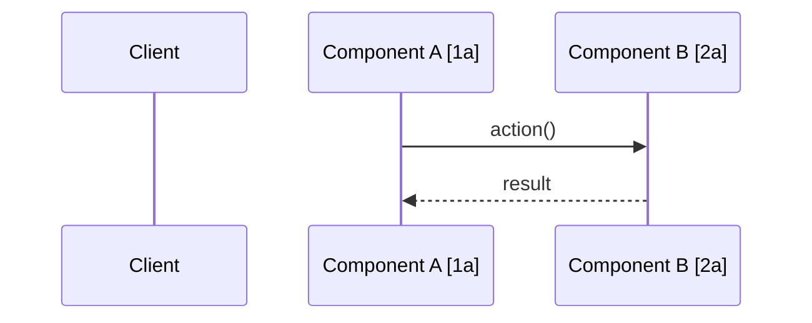
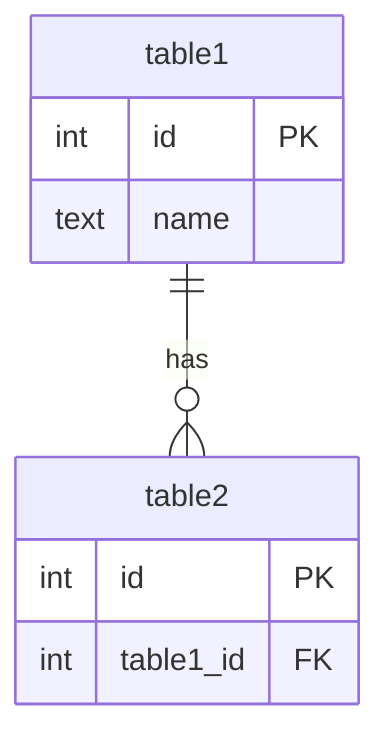
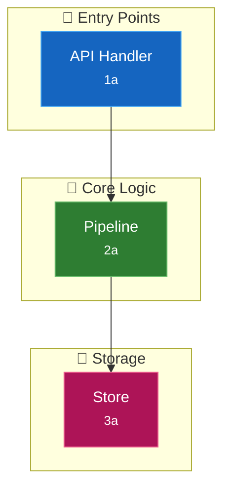
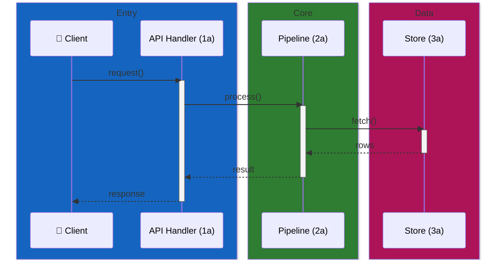
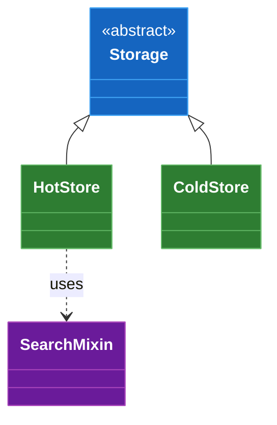

# Code Map Generator

Generate a `docs/CODEMAP.md` with visual architecture and **bidirectional links** between diagram nodes and source code.

> **Source of truth:** When the repo has a `.code-review-graph/` directory or the `code-review-graph` MCP tools are available, prefer reading the graph as the source of truth for symbols, file:line locations, and call edges (more accurate than walking the filesystem on large codebases). The output format, ID scheme, and [colour palette](#diagram-styling--colour) are unchanged — only the input source differs.

## Key Concepts

### 1. Numbered Categories

Organize components into numbered architectural layers:

- `[1]` - Entry points / hot path (resources, APIs, CLI)
- `[2]` - Server / application layer
- `[3]` - Core business logic / storage
- `[4]` - Data layer / infrastructure
- `[5]` - Background processes / async (mining, jobs)

Each category gets a section heading: `### [1] Hot Tier Resources (Auto-Injected)`

### 2. Subcategory IDs

Components within a category use letter suffixes:

- `[1a]`, `[1b]`, `[1c]` - Components in category 1
- `[2a]`, `[2b]`, `[2c]` - Components in category 2

### 3. Bidirectional Links

Every ID appears in three places:
1. **Diagram node** - `["Component Name [1a]"]`
2. **Reference table** - Links to exact file:line
3. **Source code comment** - `# [1a:SymbolName] Component description` placed on the line **directly above** the target `def`/`class`

Use `[ID:SymbolName]`, not bare `[ID]`, because reference tables often have multiple rows sharing an ID (e.g. both `calculate_ld` and `find_plink` under `[3a]`) and the sync script needs an unambiguous handle per row.

## Output Structure

### System Overview Diagram



**Important**: Use `<br/><small>ID</small>` for node labels and apply `style` directives **to each node** (not the subgraph) using the saturated fills + white text defined in [Diagram Styling & Colour](#diagram-styling--colour). Subgraph-level `style` is unreliable across Mermaid themes and leaves pale defaults underneath.

### Code Reference Tables (by Category)

Each category gets its own section with heading and table:

```markdown
### [1] Entry Points (User-Facing)

Brief description of this layer's role.

| ID | Component | Description | File:Line |
|----|-----------|-------------|-----------|
| 1a | ComponentA | Handles X | [filename.py:42](src/path/filename.py#L42) |
| 1b | ComponentB | Handles Y | [filename.py:89](src/path/filename.py#L89) |

### [2] Application Layer

| ID | Component | Description | File:Line |
|----|-----------|-------------|-----------|
| 2a | Service | Orchestrates logic | [service.py:15](src/service.py#L15) |
```

### Nested Components

For components with many sub-parts (like tool modules), use nested tables:

```markdown
#### Tool Modules [2b]

| Module | Tools | File |
|--------|-------|------|
| auth | `login`, `logout`, `refresh` | [auth.py](src/tools/auth.py) |
| data | `create`, `read`, `update` | [data.py](src/tools/data.py) |
```

### Additional Diagrams

Add focused diagrams for specific subsystems:



### Data Flow Diagrams



### Database Schema (if applicable)



### Quick Navigation Table

| Area | Entry Point |
|------|-------------|
| Server startup | [server/__init__.py](src/server/__init__.py) |
| All tools | [tools/__init__.py](src/tools/__init__.py) |
| Config | [config.py](src/config.py) |

## Source Code Annotations

After creating the code map, add anchor comments to source. Three non-negotiable rules — each exists because the looser variant **has been observed to drift within days** in real projects:

### Rule 1: `# [ID:SymbolName]`, not bare `# [ID]`

```python
# [1a:handle_request] Main entry point for API requests
def handle_request():
    ...
```

The `SymbolName` half lets the sync script resolve table rows to specific `def`/`class` declarations. Without it, IDs that cover multiple symbols (e.g. `[3a]` = `calculate_ld` AND `find_plink`) cannot be programmatically re-located when code shifts.

### Rule 2: Anchor comment lives on the line **immediately above** its target

```python
# GOOD — anchor line + 1 = target line
# [3a:calculate_ld] PLINK wrapper, lead-SNP R²
def calculate_ld(...):
    ...
```

```python
# BAD — sandwich comments, blank lines, or decorators between the anchor and
# the def break the "anchor_line + 1 == target_line" invariant the sync
# script depends on. Keep them adjacent.
```

For decorated functions the anchor goes **above the decorator**:

```python
# [4b:MatplotlibBackend] Static publication plots — see docs/CODEMAP.md
@register_backend("matplotlib")
class MatplotlibBackend:
    ...
```

### Rule 3: Never place an anchor above a module docstring

Module-level anchors at line 1 **break Sphinx `automodule`, `help()`, and IDE hover** because the first comment-or-expression in a file determines what becomes `__doc__`. Put the anchor *after* the closing `"""` of the module docstring, and reference the IDs inside the docstring prose:

```python
"""Palette module: LD, eQTL effect, credible-set, PheWAS colours.

See docs/CODEMAP.md — anchors [3b].
"""

# [3b:get_ld_color] Map R² → hex colour — see docs/CODEMAP.md
def get_ld_color(...):
    ...
```

This enables reverse navigation: seeing `[3b:get_ld_color]` in code → find it in CODEMAP.md.

## Steps

1. **Identify architectural layers** - Group by responsibility:
   - Entry points (CLI, API, resources)
   - Application/server layer
   - Core business logic
   - Data/storage layer
   - Background processes

2. **Assign category numbers** - One per layer (`[1]`, `[2]`, `[3]`...)

3. **Assign component IDs** - Letter suffixes within each category (`[1a]`, `[1b]`...)

4. **Create overview diagram** - Show all categories and connections

5. **Build reference sections** - One `### [N] Category Name` section per category

6. **Add nested tables** - For components with many sub-parts

7. **Create focused diagrams** - For complex subsystems

8. **Add source annotations** — `# [ID:SymbolName] description` on the line directly above each target `def`/`class` (see [Source Code Annotations](#source-code-annotations) for the three placement rules).

9. **Install the anti-drift sync script** — copy the template in [Anti-Drift Automation](#anti-drift-automation) to `scripts/sync-codemap.py`, wire it into pre-commit, and run `--fix` once to verify alignment.

10. **Add quick navigation** - Table of key entry points

11. **Validate** - Verify all links work and IDs match

## Anti-Drift Automation

**Context:** a real code review of a CODEMAP.md generated by an earlier version of this skill found that **every single file:line anchor had drifted within three days** of committing the doc. Hand-maintained line numbers rot at the speed of refactoring. Ship the sync script alongside the code map — without it, the doc starts lying almost immediately.

### Install

Drop this template into `scripts/sync-codemap.py`, adjust the two paths at the top to fit the repo layout, and make it executable:

```python
"""Keep docs/CODEMAP.md anchor line numbers in sync with source markers.

Every row in the CODEMAP tables is expected to be backed by a per-symbol anchor
comment of the form ``# [<id>:<symbol>]`` on the line immediately above the
target ``def``/``class``. The script does two things:

1. Verifies that each CODEMAP row's claimed line is the line *below* an anchor
   comment for the same ``<id>:<symbol>`` pair.
2. In ``--fix`` mode, rewrites the table's ``file:line`` reference to match the
   anchor's actual location in the source tree.

Exit status:
- ``0`` — CODEMAP is in sync (check mode) or was updated successfully.
- ``1`` — drift detected in check mode, or an anchor is missing entirely.
"""

from __future__ import annotations

import argparse
import re
import sys
from pathlib import Path

ROOT = Path(__file__).resolve().parent.parent
CODEMAP = ROOT / "docs" / "CODEMAP.md"
SRC_ROOT = ROOT / "src"  # ← adjust to your source root (e.g. src/<pkg>, lib/, app/)

ROW_RE = re.compile(
    r"^(?P<prefix>\|\s*(?P<id>\d[a-z])\s*\|\s*(?P<symbol>[A-Za-z_][\w]*)\s*\|[^|]*\|\s*)"
    r"\[(?P<label>[^\]]+)\]\((?P<href>[^)]+)\)"
    r"(?P<suffix>\s*\|\s*)$"
)


def find_anchor(id_: str, symbol: str) -> tuple[Path, int] | None:
    token = f"[{id_}:{symbol}]"
    for path in SRC_ROOT.rglob("*.py"):  # ← change suffix for other languages
        with path.open() as fh:
            lines = fh.readlines()
        for idx, line in enumerate(lines):
            if token not in line:
                continue
            # Target is the first non-blank, non-comment line after the anchor.
            for follow_idx in range(idx + 1, len(lines)):
                stripped = lines[follow_idx].strip()
                if not stripped or stripped.startswith("#"):
                    continue
                return path, follow_idx + 1
            return path, idx + 2
    return None


def process(fix: bool) -> int:
    text = CODEMAP.read_text()
    new_lines: list[str] = []
    errors: list[str] = []
    updates = 0

    for lineno, line in enumerate(text.splitlines(keepends=True), start=1):
        match = ROW_RE.match(line.rstrip("\n"))
        if not match:
            new_lines.append(line)
            continue

        id_, symbol = match["id"], match["symbol"]
        found = find_anchor(id_, symbol)
        if found is None:
            errors.append(
                f"CODEMAP.md:{lineno} references [{id_}:{symbol}] but no anchor "
                f"comment '# [{id_}:{symbol}]' exists under {SRC_ROOT}."
            )
            new_lines.append(line)
            continue

        anchor_path, anchor_line = found
        rel_path = anchor_path.relative_to(ROOT).as_posix()
        expected = f"[{anchor_path.name}:{anchor_line}](../{rel_path}#L{anchor_line})"
        current = f"[{match['label']}]({match['href']})"

        if current == expected:
            new_lines.append(line)
            continue

        new_lines.append(f"{match['prefix']}{expected}{match['suffix']}\n")
        if fix:
            updates += 1
        else:
            errors.append(f"CODEMAP.md:{lineno} points at {current} but anchor is at {expected}")

    if errors:
        for err in errors:
            print(err, file=sys.stderr)
        if not fix:
            print(f"\n{len(errors)} drift(s) detected. Run with --fix.", file=sys.stderr)
            return 1

    if fix and updates:
        CODEMAP.write_text("".join(new_lines))
        print(f"Updated {updates} CODEMAP.md row(s).")
    elif fix:
        print("CODEMAP.md already in sync.")

    return 1 if errors and not fix else 0


def main() -> int:
    parser = argparse.ArgumentParser(description=__doc__)
    parser.add_argument("--fix", action="store_true", help="Rewrite drifted rows.")
    return process(fix=parser.parse_args().fix)


if __name__ == "__main__":
    sys.exit(main())
```

### Wire it into pre-commit

Add a `local` hook that runs in check mode (no `--fix`) so drift fails the commit instead of being silently papered over:

```yaml
- id: sync-codemap
  name: Verify docs/CODEMAP.md anchors are in sync
  entry: python scripts/sync-codemap.py      # or `uv run python` for uv projects
  language: system
  files: '^(src/.*\.py|docs/CODEMAP\.md)$'   # adjust source glob
  pass_filenames: false
```

### Usage

- `python scripts/sync-codemap.py` — check mode; non-zero exit on drift.
- `python scripts/sync-codemap.py --fix` — rewrite CODEMAP.md rows to match current anchor locations.
- Run `--fix` whenever code moves; the pre-commit hook will refuse commits that leave drift behind.

### Language variants

The template as written is Python-only. For other languages:

- **TypeScript / JavaScript**: change `"*.py"` in `SRC_ROOT.rglob(...)` to `"*.{ts,tsx,js,jsx}"` and keep `//` or `/* */` in mind — the "non-blank non-comment after the anchor" heuristic needs the comment prefixes adjusted (swap `startswith("#")` for `startswith(("//", "/*", "*"))`).
- **Go**: `"*.go"` + `startswith("//")`.
- **Rust**: `"*.rs"` + `startswith("//")`.

The `ROW_RE` regex matching `[ID:Symbol]` in the CODEMAP table is language-agnostic.

## Example Reference

See [Memory MCP CODEMAP.md](https://github.com/michael-denyer/memory-mcp/blob/main/docs/CODEMAP.md) for a complete example with:
- Numbered category sections (`[1] Hot Tier`, `[2] MCP Server`, etc.)
- System overview flowchart with IDs in nodes
- Component reference tables per category
- Nested tables for tool modules
- Focused subsystem diagrams
- Data flow sequence diagrams
- Database schema diagram
- Quick navigation table

## Diagram Styling & Colour

**One colour per architectural layer, applied consistently across every diagram.** Readers use colour to track layers across multiple diagrams — inconsistency breaks that mental model. This section mirrors the palette used by the graph-powered [`codemap-gr`](../codemap-gr/SKILL.md) skill; use it verbatim so code maps look the same no matter which skill generated them.

### High-Contrast Palette (Flowcharts)

**High contrast means saturated fills + white text, not pastels.** Every layer below hits ≥7:1 contrast ratio (WCAG AAA) between fill and text. Strokes are one step lighter than the fill so each node has a visible edge against the subgraph backdrop.

| Layer | Fill | Stroke | Text | Contrast | Emoji |
|-------|------|--------|------|----------|-------|
| Entry points / hot path | `#1565c0` | `#42a5f5` | `#ffffff` | 8.6:1 | 🚀 |
| Application / server | `#d84315` | `#ff7043` | `#ffffff` | 5.9:1 † | ⚙️ |
| Core logic / pipeline | `#2e7d32` | `#66bb6a` | `#ffffff` | 6.4:1 | 🧠 |
| Data / storage | `#ad1457` | `#f06292` | `#ffffff` | 8.2:1 | 💾 |
| Infrastructure / async | `#6a1b9a` | `#ab47bc` | `#ffffff` | 10.4:1 | 🔧 |
| Graph-inferred fallback (⚠️) | `#ef6c00` | `#ffa726` | `#000000` | 6.8:1 | ⚠️ |
| Unverified (❓) | `#424242` | `#616161` | `#ffffff` | 11.6:1 | ❓ |

† Application/server hits AA (≥4.5:1) but not AAA.

**Contrast discipline** — rules this palette enforces:

- Fills are material-design 800-weight (L≈30–35) — dark enough for white text to hit AAA
- Text is pure white (`#ffffff`) or pure black (`#000000`) — never mid-tone greys
- **Never use pastel fills** (`#e8f4fd` etc.) — they force dark text, which washes out in dark-mode GitHub and fails contrast on amber/yellow hues entirely
- Test every diagram in both light and dark GitHub themes before committing

### Style Nodes, Not Subgraphs

Mermaid's flowchart renderer reliably applies `style NodeId fill:...` but treats styled subgraphs inconsistently — a saturated subgraph fill can be overridden by the theme or lightened in certain viewers, producing a pale backdrop with the default (also pale) node fills sitting unreadably on top.

**Leave subgraphs at their default pale-yellow fill; style every node with its layer's saturated colour + white text.** The subgraph's title and node colour together communicate the layer.



For ⚠️/❓ fallback nodes, override at the node level after the layer styling. Note ⚠️ uses black text on amber — white fails contrast here:

```mermaid
    D["Perl Script<br/><small>5a ⚠️</small>"]
    style D fill:#ef6c00,stroke:#ffa726,color:#000000
```

**Validation**: render with `mmdc` or `@probelabs/maid` and check every node label is legible. If any node shows dark-on-dark or dark-on-saturated text, you forgot the per-node `style` line.

### Node Labels

Use `<br/><small>ID</small>` instead of bracket suffixes for cleaner nodes:

```
# Prefer this:
A["Pipeline<br/><small>1a</small>"]

# Over this:
A["Pipeline [1a]"]
```

### Sequence Diagrams

Group participants into `box` regions using the **same saturated material-800 RGBs** as the flowchart node fills — never pastels. Mermaid renders participant labels as light/white text on sequence `box` fills, so a pale box (e.g. `rgb(232, 244, 253)`) leaves white-on-pale-blue text that is unreadable.

| Layer | Box RGB | Hex equivalent |
|-------|---------|----------------|
| 🚀 Entry points | `rgb(21, 101, 192)` | `#1565c0` |
| ⚙️ Application / server | `rgb(216, 67, 21)` | `#d84315` |
| 🧠 Core logic | `rgb(46, 125, 50)` | `#2e7d32` |
| 💾 Data / storage | `rgb(173, 20, 87)` | `#ad1457` |
| 🔧 Infrastructure | `rgb(106, 27, 154)` | `#6a1b9a` |



Rules:

- Box fills MUST match the flowchart layer RGBs above — no pastels, no one-off tints
- Use parentheses `(1a)` not brackets `[1a]` in aliases — brackets break Mermaid sequence syntax
- Use `activate`/`deactivate` to show call lifetimes; add `-->>` return arrows
- Verify output in both GitHub light and dark themes — if participant text on any box is hard to read, the fill is wrong (do not "fix" by switching to pastels)

### Class Diagrams

Colour abstract base classes differently from concrete implementations; group related concrete classes under one colour. Use the same saturated palette as flowcharts:



### General Formatting Rules

- One emoji per subgraph title (quick visual scan) — never more
- Don't style edges; node fills already carry the layer signal
- Render every diagram on GitHub (or via `@probelabs/maid` / `mmdc`) before committing — Mermaid is picky about whitespace in `style` lines
- If a diagram needs more than 5 layers, split it — you're drawing too much on one canvas

## Tips

- Max 10-15 nodes per diagram for readability
- Group related components in subgraphs with category number
- Use consistent ID prefixes per architectural layer
- Keep descriptions brief (5-10 words)
- Add brief context under each category heading
- Update when architecture changes significantly
